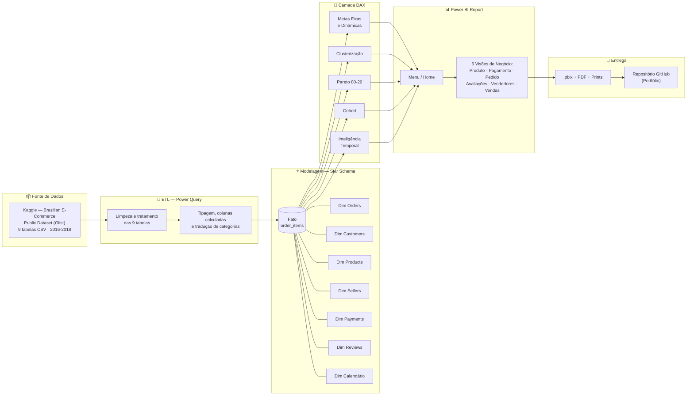
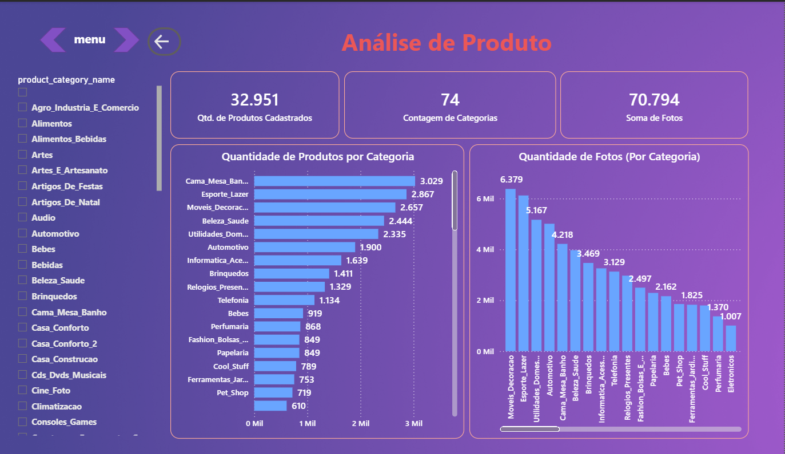
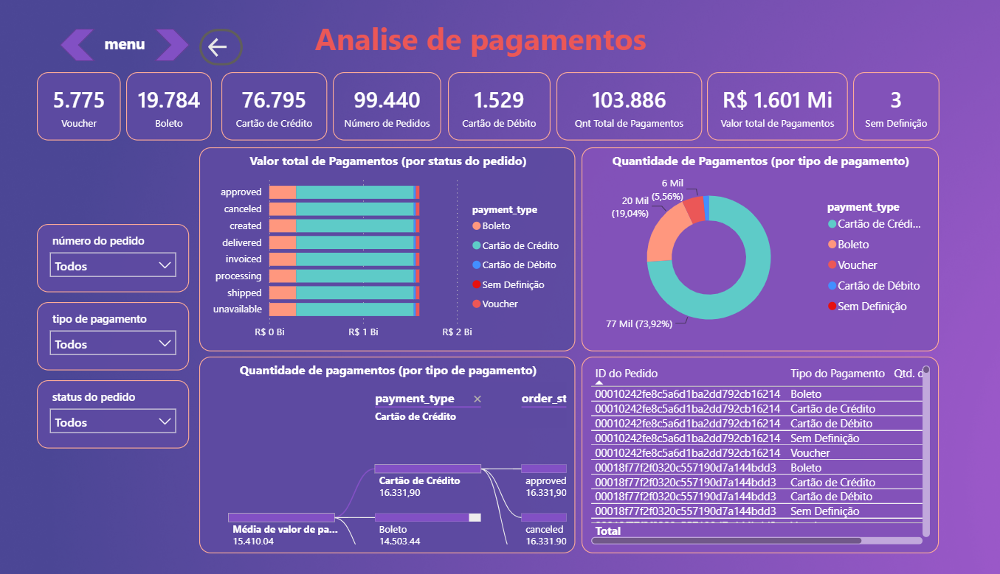
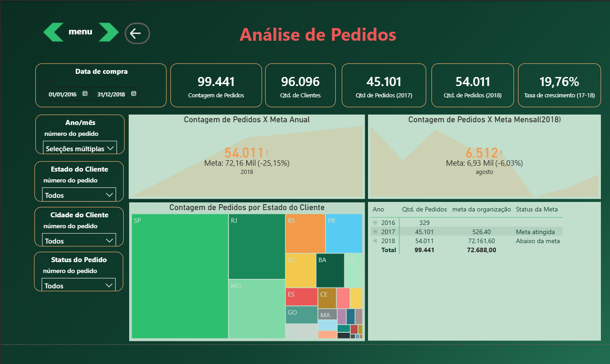
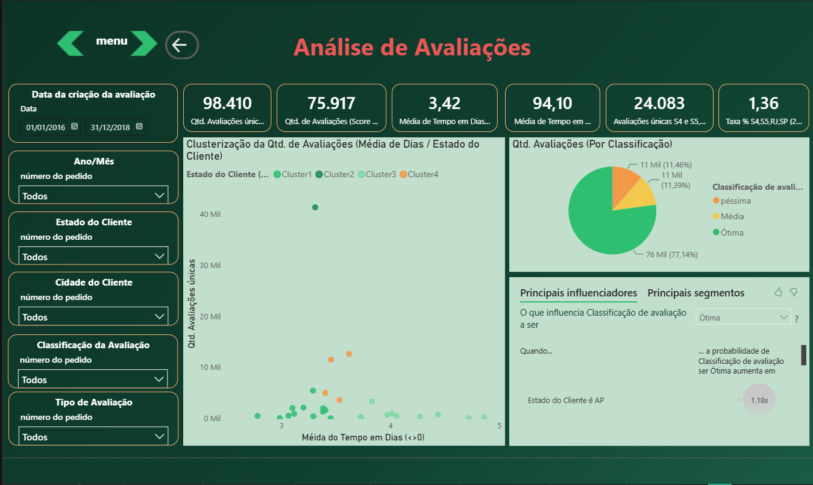
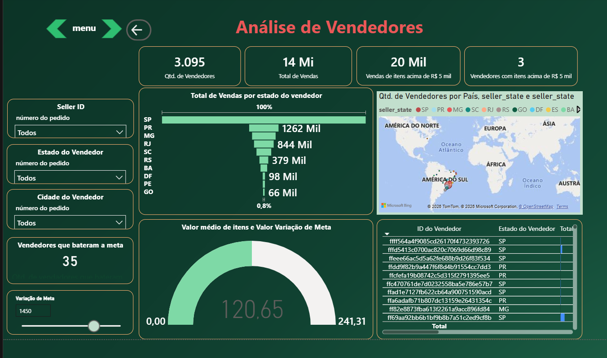
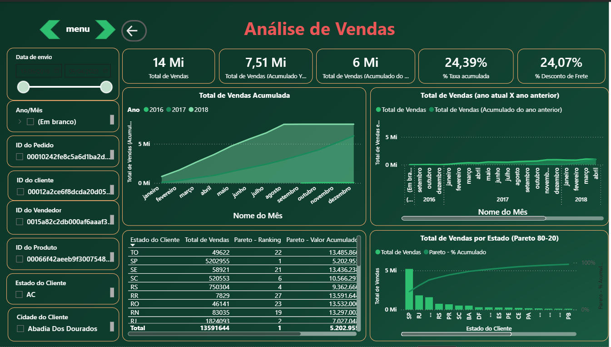
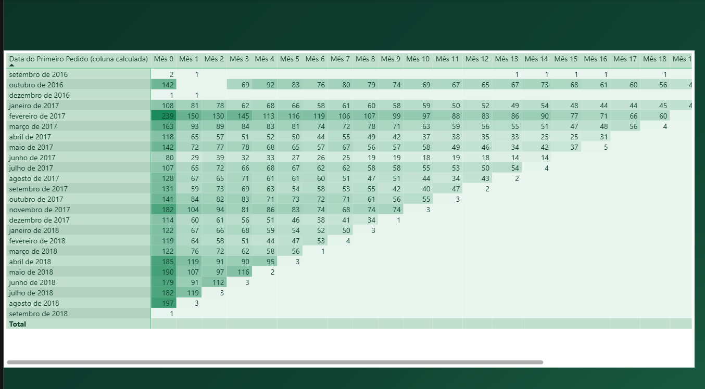

# 📊 Gerenciamento de Indicadores : Diretoria | Dashboard E-commerce


Dashboard em Power BI que consolida 6 frentes de negócio de um marketplace (Produto, Pagamento, Pedido, Avaliações, Vendedores e Vendas) em um único painel de gestão para diretoria, construído sobre o dataset público da Olist (~100 mil pedidos, 2016–2018).

---

## 1. 🎯 Problema

Uma empresa de e-commerce vinha tomando decisões estratégicas "no achismo", sem indicadores confiáveis e isso já havia gerado prejuízos. A diretoria precisava de um painel único que consolidasse, em tempo real, a saúde da operação: volume e status dos pedidos, comportamento de pagamento, satisfação do cliente, performance de vendedores e evolução das vendas, permitindo migrar de decisões intuitivas para uma abordagem **Data Driven**.

**Perguntas de negócio respondidas:**

| Visão | Pergunta central |
|---|---|
| Produto | Quais categorias mais vendem e geram mais receita? |
| Pagamento | Quais formas de pagamento e parcelamento predominam? |
| Pedido | Como os pedidos avançam frente às metas e aos anos anteriores? |
| Avaliações | O que mais influencia avaliações ruins, médias e boas? |
| Vendedores | Quem são os melhores/piores vendedores e onde estão? |
| Vendas | Como a receita evolui no tempo e quais padrões de sazonalidade/cohort existem? |

---

## 2. 🏗️ Arquitetura

Fluxo completo do dado, da origem pública até o relatório final entregue como portfólio:



**Modelo de dados:** esquema estrela clássico, com `order_items` como tabela fato e dimensões de Pedido, Cliente, Produto, Vendedor, Pagamento, Avaliação e uma tabela Calendário central (relacionada a `orders`, `order_items` e `order_reviews` por suas respectivas datas), permitindo inteligência temporal em todas as visões.

---

## 3. 🛠️ Stack

| Etapa | Ferramenta/Técnica |
|---|---|
| ETL | Power Query (integração das 9 tabelas da Olist) |
| Modelagem | Star schema : fato `order_items` + dimensões Produto, Cliente, Vendedor, Pagamento, Avaliação, Tempo |
| Cálculos | DAX : metas fixas e dinâmicas, clusterização, Pareto 80-20, cohort, inteligência temporal |
| Visualização | Power BI Desktop, navegação por página inicial com botões |
| Versionamento | Git / GitHub |

**Técnicas de destaque:** clusterização (dispersão por estado/score), curva de Pareto 80-20, análise de cohort de retenção de vendedores, parâmetro *what-if* para simular variação de meta em tela.

---

## 4. 💻 Implementação

### Home - Navegação


### Visão Produto

32.951 produtos cadastrados em 74 categorias, com destaque para Cama_Mesa_Banho (3.029), Esporte_Lazer (2.867) e Móveis_Decoração (2.657).

### Visão Pagamento

R$ 1.601 Mi em pagamentos, com Cartão de Crédito respondendo por 73,92% do volume (77 mil pagamentos), seguido de Boleto (19,04%) e Voucher (5,56%).

### Visão Pedido

54.011 pedidos em 2018 (+19,76% vs. 2017), mas 25,15% abaixo da meta anual de 72,16 mil — SP, RJ e MG concentram o maior volume de pedidos.

### Visão Avaliações

77,14% das avaliações são "Ótima", com tempo médio de 3,42 dias para retorno de avaliações sem resposta no mesmo dia; clientes do Amapá (AP) têm 1,18x mais chance de dar avaliação "Ótima".

### Visão Vendedores

3.095 vendedores, dos quais 2.376 bateram a meta; apenas 3 vendedores romperam a marca de R$500 mil em vendas — SP concentra praticamente toda a receita entre os estados.

### Visão Vendas

R$ 1.359 Mi em vendas totais; o acumulado do ano atual (R$750,66 Mi) já supera o do ano anterior no mesmo período (R$603 Mi), taxa de crescimento acumulado de 24,39%.

### Bônus — Análise de Cohort (retenção de vendedores)


📄 **[Baixe o PDF completo do dashboard aqui](./Dashboard_Completo.pdf)** — todas as páginas navegáveis, sem precisar do Power BI instalado.

### Exemplos de medidas DAX

```DAX
Total de Vendas = SUM(Order_Items[price])

Taxa de Crescimento (17-18) = 
DIVIDE([Qtd. de Pedidos 2018] - [Qtd. de Pedidos 2017], [Qtd. de Pedidos 2017])

% Atingimento da Meta Anual = 
DIVIDE([Qtd. de Pedidos], [Meta Anual de Pedidos]) - 1
```

*(substitua pelos exemplos reais mais relevantes do seu modelo — especialmente clusterização, Pareto e cohort)*

### Fonte dos dados

- **Origem:** [Brazilian E-Commerce Public Dataset by Olist](https://www.kaggle.com/datasets/olistbr/brazilian-ecommerce) (Kaggle)
- **Tabelas:** `olist_orders_dataset`, `olist_order_items_dataset`, `olist_order_payments_dataset`, `olist_order_reviews_dataset`, `olist_products_dataset`, `olist_sellers_dataset`, `olist_customers_dataset`, `product_category_name_translation`, `olist_geolocation_dataset`
- **Período:** 2016–2018

### Estrutura do repositório

```
├── images/                  # prints de todas as páginas do dashboard
├── Dashboard_Completo.pdf   # export em PDF para visualização sem Power BI
├── gerenciamento-indicadores-olist.pbix   # arquivo original do Power BI
├── dataset/                 # LEIA-ME.md com o link do Kaggle (dados não versionados por serem grandes/públicos)
├── CONTEXTO_PROJETO.md      # contexto detalhado do projeto
└── README.md
```

### Como visualizar

- **Sem Power BI instalado:** veja os [prints acima](#4--implementação) ou baixe o [PDF completo](./Dashboard_Completo.pdf)
- **Com Power BI Desktop:** baixe o arquivo `.pbix` deste repositório e abra localmente

---

## 5. 📈 Resultados, aprendizados e próximos passos

### Resultados

- Em 2018 a empresa cresceu 19,76% em pedidos frente a 2017, mas ficou 25,15% abaixo da meta anual, evidenciando que as metas estavam desalinhadas com a capacidade real de crescimento.
- Cartão de crédito domina os pagamentos (73,92%), concentração que pode ser explorada em negociações com operadoras ou em campanhas de meios alternativos.
- Apesar de 77,14% das avaliações serem "Ótima", o tempo médio de resposta a avaliações sem retorno no mesmo dia (3,42 dias) é um ponto de atenção para retenção de clientes.
- A receita de vendedores é extremamente concentrada: apenas 3 dos 3.095 vendedores romperam R$500 mil em vendas, e SP domina o total de vendas por estado, padrão também confirmado pela curva de Pareto 80-20.
- O catálogo de produtos é liderado por categorias de casa e lazer (Cama_Mesa_Banho, Esporte_Lazer, Móveis_Decoração), o que pode orientar decisões de sortimento e marketing.

### Aprendizados

[O que foi mais desafiador tecnicamente? Ex: "Implementar a análise de cohort em DAX puro" ou "Modelar a clusterização de clientes sem usar Python, apenas DAX/Power Query".]

### Próximos passos

- [ ] Publicar o relatório no Power BI Service para navegação online (não apenas prints/PDF)*********
- [ ] Automatizar a atualização dos dados via gateway/agendamento

---

## 📬 Contato

- LinkedIn: [linkedin.com/in/iannfava](https://www.linkedin.com/in/iannfava)
- E-mail: iannfava@gmail.com

---
