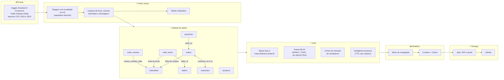

# 📊 Gerenciamento de Indicadores : Diretoria | Dashboard E-commerce


Dashboard em Power BI que consolida 6 frentes de um marketplace (Produto, Pagamento, Pedido, Avaliações, Vendedores e Vendas) em um painel de gestão para diretoria, construído sobre o dataset público da Olist (99.441 pedidos, 2016 a 2018).

---

## 1. 🎯 Problema

Uma empresa de e-commerce tomava decisões estratégicas "no achismo", sem indicadores confiáveis, e isso já havia gerado prejuízos. A diretoria precisava de um painel único para acompanhar a saúde da operação: volume e status dos pedidos, comportamento de pagamento, satisfação do cliente, desempenho dos vendedores e evolução das vendas, migrando para uma abordagem **Data Driven**.

| Visão | Pergunta central |
|---|---|
| Produto | Como o catálogo se distribui entre categorias (produtos e fotos)? |
| Pagamento | Quais formas de pagamento predominam e quanto movimentam por status do pedido? |
| Pedido | Como os pedidos avançam frente às metas e aos anos anteriores? |
| Avaliações | O que influencia a classificação das avaliações e como os estados se agrupam? |
| Vendedores | Quantos vendedores batem a meta, quanto vendem e onde estão? |
| Vendas | Como a receita evolui no tempo, como se concentra por estado (Pareto) e quanto os vendedores retêm (cohort)? |

---

## 2. 🏗️ Arquitetura



**Modelo de dados:** uma tabela Calendário compartilhada por pedidos, itens e avaliações, cada um pela sua data. Pagamentos se ligam a pedidos, e pedidos a clientes (`customer_unique_id`, para contar pessoas e não pedidos). Itens se ligam a vendedores. A tabela de produtos é analisada de forma independente na Visão Produto. As coordenadas de geolocalização foram incorporadas à tabela de vendedores.

---

## 3. 🛠️ Stack

| Etapa | Ferramenta |
|---|---|
| ETL | Power Query (linguagem M) |
| Modelagem | Relacionamentos 1:N e 1:1 no Power BI |
| Cálculos | DAX |
| Visualização | Power BI Desktop, com tema próprio e menu de navegação por botões |
| Versionamento | Git e GitHub |

---

## 4. 💻 Implementação

### Menu


### Visão Produto

32.951 produtos em 74 categorias, liderados por Cama_Mesa_Banho (3.029), Esporte_Lazer (2.867) e Móveis_Decoração (2.657).

### Visão Pagamento

R$ 16 milhões em 103.886 pagamentos. Cartão de crédito responde por 73,92% dos pagamentos, seguido de boleto (19,04%) e voucher (5,56%). Valor médio por pagamento: R$ 154,10.

### Visão Pedido

54.011 pedidos em 2018, crescimento de 19,76% sobre 2017. A meta anual exigia crescer 60% sobre o ano anterior (72,16 mil pedidos), e a empresa ficou 25,15% abaixo dela. No último mês completo (agosto de 2018), 6.512 pedidos contra meta de 6,93 mil (-6,03%).

### Visão Avaliações

98.410 avaliações, 77,14% delas "Ótima". Tempo médio de 3,42 dias para avaliações sem retorno no mesmo dia. Clientes do Amapá têm 1,18x mais chance de avaliar como "Ótima".

### Visão Vendedores

3.095 vendedores e R$ 13,6 milhões em vendas. Com o parâmetro de meta padrão (R$ 50 de valor médio por item), 2.376 vendedores atingem a meta. Apenas 3 vendedores venderam itens acima de R$ 5 mil.

### Visão Vendas

Vendas acumuladas no ano de R$ 7,51 milhões contra R$ 6 milhões no mesmo período do ano anterior (+24,39%). São Paulo responde por R$ 5,2 milhões, cerca de 38% do total.

### Análise de Cohort (retenção de vendedores)


📄 **[PDF completo do dashboard](./Dashboard_Completo.pdf)**, para navegar sem o Power BI instalado.

### Exemplos de medidas DAX

```DAX
Total de Vendas = SUM('order_items'[price])

Taxa de crescimento (17-18) =
DIVIDE([Qtd. de Pedidos (2018)], [Qtd de Pedidos (2017)]) - 1

meta da organização = [Qtd. de Pedidos (ano anterior)] * 1.6

Qtd. de Clientes = DISTINCTCOUNT(costumers[customer_unique_id])

Pareto - Ranking =
RANKX(ALLSELECTED(order_items[Estado do Cliente]), [Total de Vendas])

Pareto - Valor Acumulado =
CALCULATE(
    [Total de Vendas],
    TOPN([Pareto - Ranking], ALLSELECTED(order_items[Estado do Cliente]), [Total de Vendas]))

Pareto - % Acumulado =
DIVIDE(
    [Pareto - Valor Acumulado],
    CALCULATE([Total de Vendas], ALLSELECTED(order_items[Estado do Cliente])))
```

### Fonte dos dados

- **Origem:** [Brazilian E-Commerce Public Dataset by Olist](https://www.kaggle.com/datasets/olistbr/brazilian-ecommerce) (Kaggle)
- **Tabelas usadas:** `olist_orders_dataset`, `olist_order_items_dataset`, `olist_order_payments_dataset`, `olist_order_reviews_dataset`, `olist_products_dataset`, `olist_sellers_dataset`, `olist_customers_dataset`, `olist_geolocation_dataset`
- **Período:** 2016 a 2018. Setembro e outubro de 2018 têm poucos pedidos (fim do dataset) e ficam fora do acompanhamento mensal de metas.

### Estrutura do repositório

```
├── images/                                # prints das páginas do dashboard
├── dataset/LEIA-ME.md                     # link do Kaggle (CSVs não versionados)
├── Dashboard_Completo.pdf                 # export em PDF
├── gerenciamento-indicadores-olist.pbix   # arquivo do Power BI
└── README.md
```

### Como visualizar

- **Sem Power BI:** veja os prints acima ou o [PDF completo](./Dashboard_Completo.pdf).
- **Com Power BI Desktop:** baixe o `.pbix` e abra localmente. Para atualizar os dados, baixe os CSVs do Kaggle e ajuste o caminho das fontes no Power Query.

---

## 5. 📈 Resultados, aprendizados e próximos passos

### Resultados

- A empresa cresceu 19,76% em pedidos de 2017 para 2018, mas a meta pedia 60%. O resultado ficou 25,15% abaixo da meta anual, o que sugere metas descoladas da capacidade real de crescimento.
- A recompra é baixa: 99.441 pedidos para 96.096 clientes, ou seja, quase todo cliente comprou uma única vez.
- As vendas são concentradas: São Paulo sozinho responde por cerca de 38% da receita.
- Cartão de crédito domina os pagamentos (73,92%).
- 77,14% das avaliações são "Ótima", mas avaliações sem retorno no mesmo dia levam em média 3,42 dias para resposta.

### Aprendizados

Na revisão do projeto, encontrei e corrigi problemas que não apareciam à primeira vista:

- **Separador decimal:** os CSVs usam ponto decimal, e o Power BI em português leu `58.90` como `5890`. Todos os valores em reais estavam 100 vezes maiores. Corrigi a tipagem no Power Query com a localidade en-US e ajustei os limites das medidas para a escala real.
- **Relacionamentos faltando:** gráficos da Visão Pagamento repetiam o mesmo total para todos os status, porque `payments` não estava ligada a `orders`. Criar o relacionamento corrigiu os três visuais da página.
- **Clientes x pedidos:** na Olist, `customer_id` muda a cada pedido. Contar clientes reais exigiu usar `customer_unique_id`.
- **Dados incompletos:** um "-99,95%" na meta mensal era só o fim do dataset (4 pedidos em outubro de 2018), e não um problema de negócio.
- **Higiene do modelo:** removi medidas duplicadas de exercícios e renomeei medidas com nomes enganosos (uma "média" que calculava mediana).

### Próximos passos

- [ ] Publicar o relatório no Power BI Service para navegação online
- [ ] Parametrizar o caminho dos arquivos no Power Query, para qualquer pessoa conseguir atualizar os dados
- [ ] Ligar `products` a `order_items` para analisar vendas por categoria
- [ ] Definir o limite de desconto de frete com base na distribuição de preços, em vez de um valor fixo

---

## 📬 Contato

- LinkedIn: [linkedin.com/in/iannfava](https://www.linkedin.com/in/iannfava)
- E-mail: iannfava@gmail.com
