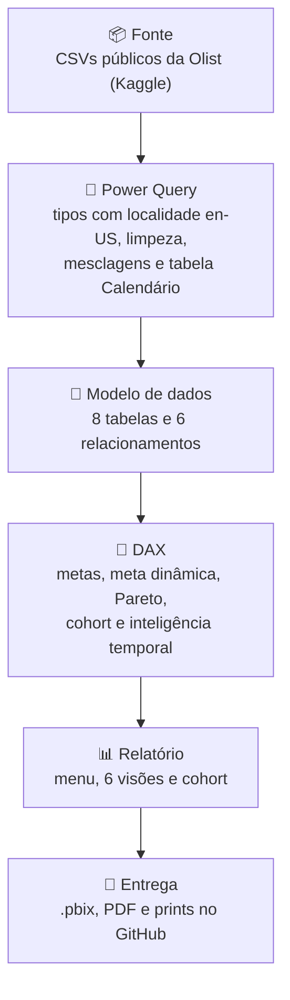
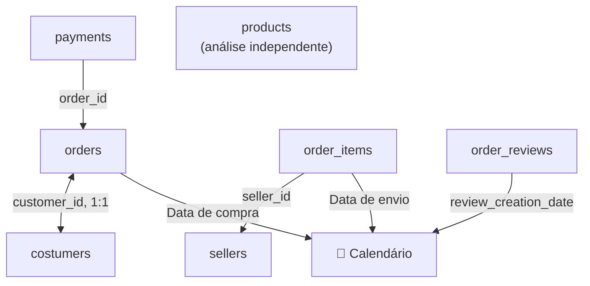

# 📊 Gerenciamento de Indicadores : Diretoria | Dashboard E-commerce


Dashboard em Power BI com 6 visões de negócio de um marketplace, construído sobre o dataset público da Olist (99.441 pedidos, 2016 a 2018).

> **Sobre este projeto:** a base veio de um curso guiado. Depois, fiz uma revisão independente e encontrei erros que distorciam os números, como valores em reais 100 vezes maiores e gráficos repetindo o mesmo total em todas as categorias. O que encontrei e como corrigi está na seção 5.

---

## 1. 🎯 Problema

Uma empresa de e-commerce tomava decisões "no achismo". A diretoria precisava de um painel único para acompanhar produto, pagamentos, pedidos, avaliações, vendedores e vendas, com metas e comparação entre períodos.

---

## 2. 🏗️ Arquitetura

### Fluxo do dado



### Modelo de dados



As setas vão do lado "muitos" para o lado "um". A Calendário é compartilhada por pedidos, itens e avaliações, cada um pela sua data.

---

## 3. 🛠️ Stack

| Etapa | Ferramenta |
|---|---|
| ETL | Power Query (M) |
| Modelagem e cálculos | Relacionamentos 1:N e 1:1, DAX |
| Visualização | Power BI Desktop, tema próprio e menu com botões |
| Versionamento | Git e GitHub |

---

## 4. 💻 Implementação

<table>
<tr>
<td width="50%"><br><b>Produto</b></td>
<td width="50%"><br><b>Pagamento</b></td>
</tr>
<tr>
<td><br><b>Pedido</b></td>
<td><br><b>Avaliações</b></td>
</tr>
<tr>
<td><br><b>Vendedores</b></td>
<td><br><b>Vendas</b></td>
</tr>
</table>

📄 **[PDF com as 8 páginas](./Dashboard_Completo.pdf)**, para ver sem o Power BI. Para abrir o `.pbix`, use o Power BI Desktop. Os CSVs não estão no repositório: baixe no [Kaggle](https://www.kaggle.com/datasets/olistbr/brazilian-ecommerce) e ajuste o caminho das fontes no Power Query.

<details>
<summary><b>Exemplo de DAX: Pareto 80-20 por estado</b></summary>

```DAX
Pareto - Ranking =
RANKX(ALLSELECTED(order_items[Estado do Cliente]), [Total de Vendas])

Pareto - Valor Acumulado =
CALCULATE(
    [Total de Vendas],
    TOPN([Pareto - Ranking], ALLSELECTED(order_items[Estado do Cliente]), [Total de Vendas]))

Pareto - % Acumulado =
DIVIDE(
    [Pareto - Valor Acumulado],
    CALCULATE([Total de Vendas], ALLSELECTED(order_items[Estado do Cliente])))
```

</details>

---

## 5. 🔍 Revisão, resultados e próximos passos

### O que encontrei e corrigi

| Sintoma | Causa | Correção |
|---|---|---|
| Vendas de R$ 1,36 bilhão (o real é R$ 13,6 milhões) | CSVs usam ponto decimal; o Power BI em português leu `58.90` como `5890` | Tipagem com localidade en-US no Power Query e limites das medidas ajustados à escala real |
| Gráficos de pagamento com o mesmo total em todos os status | `payments` sem relacionamento com `orders` | Relacionamento `payments` → `orders`, que corrigiu 3 visuais |
| "Clientes" igual ao número de pedidos (99.441) | `customer_id` muda a cada pedido | Contagem por `customer_unique_id`: 96.096 clientes |
| Dois cartões com erro na Visão Avaliações | Fórmula comparava `review_id` (texto) com número | Troca para `review_score` |
| Meta mensal com -99,95% | Fim do dataset: só 4 pedidos em outubro de 2018 | Acompanhamento mensal até agosto, último mês completo |
| 2016 marcado como "meta atingida" | Meta vazia tratada como zero | Medida de status com `ISBLANK` e `HASONEVALUE` |

Também removi medidas duplicadas de exercícios e renomeei medidas com nomes enganosos.

### Principais achados

- **Metas descoladas da realidade:** os pedidos cresceram 19,76% em 2018, mas a meta pedia 60%. Resultado: 25,15% abaixo da meta anual.
- **Recompra baixa:** 99.441 pedidos para 96.096 clientes. Quase todo cliente comprou uma única vez.
- **Vendas concentradas:** São Paulo responde por cerca de 38% da receita.
- **Pagamento:** cartão de crédito domina, com 73,92% dos pagamentos.
- **Satisfação:** 77,14% das avaliações são "Ótima".

### Próximos passos

- Ligar `products` a `order_items` para analisar vendas por categoria
- Parametrizar o caminho dos arquivos, para qualquer pessoa conseguir atualizar os dados
- Publicar no Power BI Service para navegação online

---

📬 [LinkedIn](https://www.linkedin.com/in/iannfava) · iannfava@gmail.com
